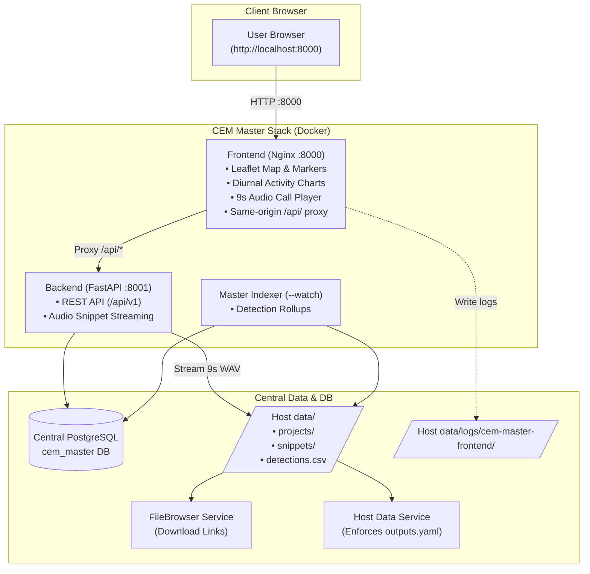

# CEM Master — Frontend Map & Dashboard

Public, interactive biodiversity map, diurnal activity charts, species search, and 9-second bird call audio player for the Continuous Ecological Monitoring (CEM) network.

---

## 1. Directory Mounts & Volume Layout (§1)

The frontend is served via Nginx with live code bind-mounted for rapid iteration. No models, sensitive credentials, or data files are baked into the image:

| Host Folder | Container Path | Purpose & Lifecycle |
| :--- | :--- | :--- |
| `code/` (`./index.html`, `./js`, `./styles`, `./leaflet`) | `/usr/share/nginx/html` | HTML/JS/CSS source assets. Live-edited on host; refreshed via browser. |
| `models/` | `/app/models` | N/A (Frontend is a client UI). |
| `data/` (`../cem-backend/data`) | `/data` | Read-only access to public audio snippets and project assets via backend proxy. |

- **Acceptance**: Code changes take effect without rebuilding the image; data remains persisted under `data/`.

---

## 2. Compute & API Orchestration (§2)

The frontend communicates with the master backend API, which delegates detection rollups and audio indexing locally or via Apache Airflow depending on `AIRFLOW_API_BASE`:

- **Airflow Active**: If `AIRFLOW_API_BASE` is set in the backend environment, long-running pipeline jobs and indexer runs are triggered via Airflow STACD DAGs.
- **Local Active**: When unset, the in-container indexer process processes detection files directly.

---

## 3. Docker Registry & Image Pull (§3)

The frontend image is pre-built and published to GitHub Container Registry and Docker Hub:

```bash
docker pull ghcr.io/corestack-org/cem-master-frontend:latest
```

---

## 4. Authentication & Google SSO (§4)

- **Read-Only Public Catalog**: Exploring monitoring spots, searching bird species, inspecting diurnal activity heatmaps, and listening to 9s audio snippets does not require authentication.
- **Single Sign-On (SSO)**: Google Identity Services / OAuth 2.0 (`GOOGLE_CLIENT_ID` in `.env`) is used for administrative access and authenticated triggers. Client secrets are never embedded in client-side code.

---

## 5. Logging & Observability (§5)

- **Log Path**: `data/logs/cem-master-frontend/` (Nginx access and error logs).
- **Log Level**: Governed by `LOG_LEVEL` (`debug` | `info` | `error`).

```bash
# View live web server logs
docker compose logs -f frontend
```

---

## 6. Unified Same-Origin Architecture (§6) & Dynamic API Base URL (§7)

- **Same-Origin Reverse Proxy**: The frontend container runs on port `8000` and reverse-proxies `/api/*` requests to the FastAPI backend (`backend:8001`) over the internal Docker network.
- **Dynamic Configuration**: `API_BASE_URL` in `js/config.js` defaults to `window.location.origin` (relative `/`). No localhost addresses or production hostnames are hardcoded into JavaScript files.

---

## 8. Architecture Diagram (§8)



---

## 9. Central PostgreSQL Database (§9)

Database storage is centralized across the cluster. The master stack connects to PostgreSQL via `DATABASE_URL` in `cem-master-backend/.env`. All spot summaries, species metrics, and snippet URLs persist permanently across container recreations.

---

## 10. Output Retention Policy (`outputs.yaml`) (§10)

Output trees under `data/` follow the retention rules defined in [`outputs.yaml`](outputs.yaml):
- **`public`**: Public monitoring spots, species detection summaries, and 9-second bird audio snippet files.
- **`private_persistent`**: Nginx web server access/error logs.
- **`delete`** (`ttl_days: 7`): Temporary static asset build caches.

---

## Development & Operations

The frontend is managed as part of the unified stack from `cem-master-backend`:

```bash
# Start the full stack (Frontend + Backend + Indexer + DB)
cd ../cem-master-backend
./scripts/dev-up.sh -d

# Restart frontend after style/script changes
docker compose restart frontend
```

Open <http://localhost:8000> in your browser.
