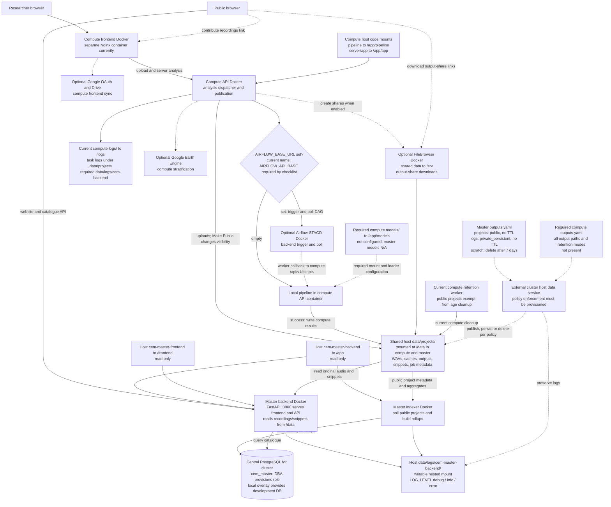

# CEM Master frontend

The public CEM map and biodiversity dashboard, built with HTML, JavaScript, CSS,
and Leaflet. It displays monitoring spots, species search, detection summaries,
activity charts, acoustic indices, raw recording playback, and available bird
call snippets and analysis links.

## Local setup links

- [Local setup guide](https://github.com/err400/cem-master-backend/blob/main/docs/local-setup.md)
- [Full setup and environment guide](https://github.com/err400/cem-master-backend/blob/main/CEM_SETUP_GUIDE.md)


## Run the website

Follow the [complete setup guide](https://github.com/err400/cem-master-backend/blob/main/CEM_SETUP_GUIDE.md)
in `cem-master-backend`. The backend's Compose stack mounts this checkout at
`/frontend` and serves both the website and API on **http://localhost:8000**.
This repository has no standalone Compose stack. Its legacy `FRONTEND_PORT`
example is not used by the unified master deployment.

## Architecture Diagram

The master serves the public website and catalogue; researchers trigger compute
through the separate compute UI. Dotted arrows indicate optional integrations
or required changes rather than installed services.


```mermaid
flowchart TB
    Public["Public browser"]
    Researcher["Researcher browser"]
    ComputeUI["Compute frontend Docker<br/>separate Nginx container currently"]
    Compute["Compute API Docker<br/>analysis dispatcher and publication"]
    Dispatch{"AIRFLOW_BASE_URL set?<br/>current name; AIRFLOW_API_BASE required by checklist"}
    Airflow["Optional Airflow-STACD Docker<br/>backend trigger and poll"]
    Local["Local pipeline in compute API container"]
    CodeCompute["Compute host code mounts<br/>pipeline to /app/pipeline<br/>server/app to /app/app"]
    Models["Required compute models/ to /app/models<br/>not configured; master models N/A"]
    Data["Shared host data/projects/<br/>mounted at /data in compute and master<br/>WAVs, caches, outputs, snippets, job metadata"]
    ComputeLogs["Current compute logs/ to /logs<br/>task logs under data/projects<br/>required data/logs/cem-backend"]
    GEE["Optional Google Earth Engine<br/>compute stratification"]
    Drive["Optional Google OAuth and Drive<br/>compute frontend sync"]
    App["Master backend Docker<br/>FastAPI :8000 serves frontend and API<br/>reads recordings/snippets from /data"]
    Indexer["Master indexer Docker<br/>poll public projects and build rollups"]
    MasterCode["Host cem-master-backend to /app<br/>read only"]
    Frontend["Host cem-master-frontend to /frontend<br/>read only"]
    DB[("Central PostgreSQL for cluster<br/>cem_master; DBA provisions role<br/>local overlay provides development DB")]
    Logs["Host data/logs/cem-master-backend/<br/>writable nested mount<br/>LOG_LEVEL debug / info / error"]
    FB["Optional FileBrowser Docker<br/>shared data to /srv<br/>output-share downloads"]
    Sweep["Current compute retention worker<br/>public projects exempt from age cleanup"]
    Policy["Master outputs.yaml<br/>projects: public, no TTL<br/>logs: private_persistent, no TTL<br/>scratch: delete after 7 days"]
    ComputePolicy["Required compute outputs.yaml<br/>all output paths and retention modes<br/>not present"]
    HostService["External cluster host data service<br/>policy enforcement must be provisioned"]

    Researcher --> ComputeUI
    ComputeUI -->|"upload and server analysis"| Compute
    ComputeUI -.-> Drive
    Compute --> Dispatch
    Dispatch -->|"empty"| Local
    Dispatch -->|"set: trigger and poll DAG"| Airflow
    Airflow -.->|"worker callback to compute /api/v1/scripts"| Local
    CodeCompute --> Compute
    Models -.->|"required mount and loader configuration"| Local
    Compute -->|"uploads; Make Public changes visibility"| Data
    Local -->|"success: write compute results"| Data
    Compute --> ComputeLogs
    Compute -.-> GEE
    Public -->|"website and catalogue API"| App
    Public -.->|"contribute recordings link"| ComputeUI
    MasterCode --> App
    MasterCode --> Indexer
    Frontend --> App
    Data -->|"public project metadata and aggregates"| Indexer
    Data -->|"read original audio and snippets"| App
    Indexer -->|"write catalogue rollups"| DB
    App -->|"query catalogue"| DB
    App --> Logs
    Indexer --> Logs
    Compute -.->|"create shares when enabled"| FB
    Public -.->|"download output-share links"| FB
    FB --> Data
    Sweep -->|"current compute cleanup"| Data
    Policy -.-> HostService
    ComputePolicy -.-> HostService
    HostService -.->|"publish, persist or delete per policy"| Data
    HostService -.->|"preserve logs"| Logs
```

Master does not run BirdNET and has no model weights. Compute's required model
mount is shown as missing, rather than suggesting it is already provisioned.
Airflow dispatch currently uses `AIRFLOW_BASE_URL`; worker callback routing must
be configured separately. See the
[compute architecture](https://github.com/err400/cem-backend/blob/master/README.md#architecture-diagram)
for execution details and the separate browser-local watcher option.

`outputs.yaml` declares master retention categories; Compose does not run the
host data service or enforce that policy. Compute has an independent cleanup
worker and still needs its own host-service policy. Cluster deployment uses
central PostgreSQL; the bundled PostgreSQL overlay is for local development or
the separately documented single-server installation, not cluster provisioning.

## Directory Mounts & Editing

`index.html`, `js/`, `styles/`, and `leaflet/` are mounted into the unified application container read-only:

| Host Folder | Container Path | Purpose & Lifecycle |
| :--- | :--- | :--- |
| `index.html`, `js/`, `styles/`, `leaflet/` | `/frontend:ro` | Frontend assets, served directly by FastAPI on `/`. |

- **Live edits**: HTML, CSS, and JS edits take effect immediately upon browser refresh .

## What the Dashboard Shows

1. **Interactive Leaflet Map**:
   - Spot markers clustered and color-coded by detection intensity.
   - **Spiderweb Expansion**: Spots from multiple projects sharing the same GPS coordinates spiderfy into separate project pins on click/zoom.
2. **Species Search & Discovery**:
   - Search by common or scientific bird name with instant autocomplete suggestions.
   - Unveils spots where that bird was detected.
3. **9-Second Audio Snippet Player**:
   - **Global Showcase**: Left sidebar plays the network-wide highest confidence 9s focal call clip for the selected species.
   - **Spot Inventory Table**: Bird rows with an available snippet have a `[ 9s ]` play button for auditioning calls recorded at that spot.
   - **Spot Observation Banner**: Representative focal call clip in the spot species view.
4. **Bioacoustic & Temporal Analytics**:
   - **Species Diurnal Activity**: 24-hour bar chart displaying calling activity across the day (00:00 to 23:00).
   - **24-Hour Species Heatmap Matrix**: Normalized hourly activity for the top 20 most active birds at a spot.
   - **Occurrence Time Series**: Daily detection timeline graph.
   - **Soundscape Indices**: ACI (Acoustic Complexity), ADI (Diversity), AEI (Evenness), NDSI, Bioacoustic Index.
   - **Seasonal & Solar Metrics**: SCI (Seasonal Concentration), PMR (Peak-to-Median Ratio), Kurtosis, sunrise correlation.
5. **Raw Audio Recordings Browser**:
   - Paginated list of full audio recordings with visual sound wave progress and playback.
6. **Analysis Jobs & Provenance**:
   - Lists completed analysis runs with downloadable results via FileBrowser share links (`FILEBROWSER_PUBLIC_URL`).

## Code Structure

```text
cem-master-frontend/
├── index.html              Single-page application layout
├── js/
│   ├── config.js           Fallback API configuration (CEM_MASTER_CONFIG)
│   ├── main.js             Core UI rendering, event handling, and audio player
│   ├── features/
│   │   └── MapManager.js   Leaflet map setup, custom markers, and spiderfy clustering
│   └── services/
│       ├── DashboardService.js  REST client for /api/v1/species, /spots, /recordings
│       └── SpotsService.js      REST client for GeoJSON spot features
├── styles/
│   └── style.css           Vanilla CSS design system (earth tones, glassmorphism, responsive)
└── leaflet/                Local Leaflet map library and assets
```

## Deployment configuration

Website: https://www.cse.iitd.ernet.in/act4dws5/bio-master/

Set these in the master backend's private `.env` for the current deployed proxy:

```dotenv
API_BASE_URL=https://www.cse.iitd.ernet.in/act4dws5/bio-master/api
COMPUTE_FRONTEND_URL=https://www.cse.iitd.ernet.in/act4dws5/bio/
BACKEND_CORS_ORIGINS=https://www.cse.iitd.ernet.in
```

FastAPI serves runtime browser configuration at `/js/config.js`, overriding the
checked-in fallback. The proxy must expose that route under the website prefix.
API JSON requests and audio URLs must preserve the configured API base; a leading
`/api/v1/...` media path must not discard the deployment prefix.

## Editing and tests

`index.html` contains the layout, `js/main.js` renders the dashboard and players,
`js/services/` calls the API, `js/features/MapManager.js` manages the map, and
`styles/style.css` supplies styles. The bundled Leaflet assets are in `leaflet/`.

With the current bind mount, asset changes appear after browser refresh. An
image-based release must package the assets. No database migration is needed
for frontend-only edits.

With Node.js installed:

```bash
node --test tests/*.test.mjs
```

## Troubleshooting

Use [DEBUGGING.md](https://github.com/err400/cem-master-frontend/blob/main/DEBUGGING.md) for browser diagnostics. If recordings are listed
but do not play, inspect the actual audio request in DevTools Network: confirm
the deployment prefix and an audio response. `Audio file not found` means the
backend could not locate the WAV in its data mount; metadata alone is not enough.
Download links require both compute-created shares and master
`FILEBROWSER_PUBLIC_URL`; blank configuration means output names without links.

Compute owns original recordings and job-output retention. The master frontend
does not implement its own output retention policy.

## Logging & DevTools Diagnostics

Set `LOG_LEVEL=debug` or `DEBUG=true` in the master backend's `.env`, recreate
its configured stack, and refresh the browser. FastAPI serves runtime flags and
browser configuration dynamically. In DevTools Console, enable Verbose output.

Temporary override: `globalThis.DEBUG = true`. Persistent override:
`localStorage.setItem('DEBUG', 'true')`. Reset with
`delete globalThis.DEBUG; localStorage.removeItem('DEBUG')`.
See [DEBUGGING.md](https://github.com/err400/cem-master-frontend/blob/main/DEBUGGING.md) for request and audio diagnostics.

## Output Retention Policy

The frontend is a static client; storage policies are owned by backend/compute.
[Master outputs.yaml](https://github.com/err400/cem-master-backend/blob/main/outputs.yaml) declares lifecycle
policies for a separately configured cluster host data service. Local Compose
does not enforce that file. Compute's retention worker manages its job outputs.
